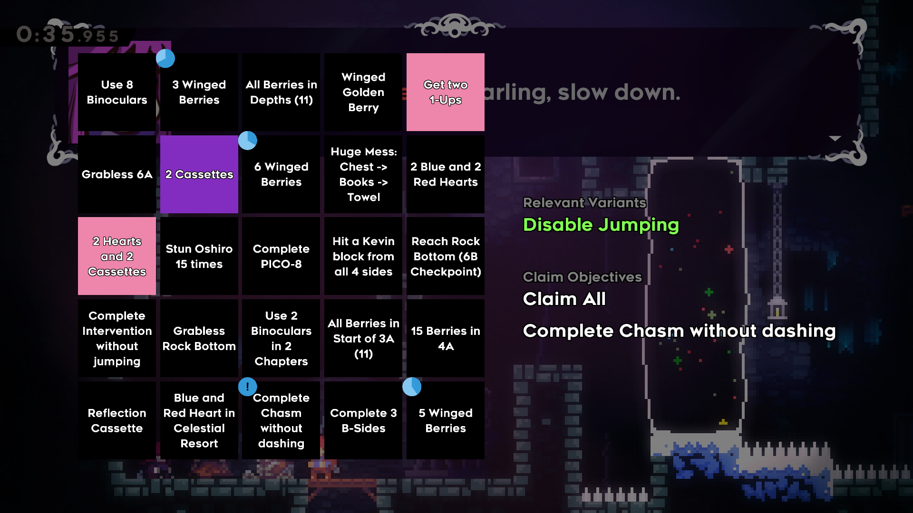

# Celeste Bingo Client

This is a Celeste mod which adds a client interface to the BingoSync website from within the game.

## Beta Testing

This mod is currently in a **beta testing phase**.
You can help!

1) For the time being, you need to be on the Everest *beta branch*. In the mod options menu, select "Change Everest Version" and select the largest number in the "beta" category.
2) Install the mod from [GameBanana](https://gamebanana.com/guis/36684)
3) Play some bingo games! See what happens!
4) If you find anything wrong, tell me! There's a list of known bugs [here](https://github.com/rhelmot/CelesteBingoClient/issues). If you find a new bug, you can either open a new issue, or if you don't have a github account you can ping me on discord.

## What to Expect

- Check out the mod settings section for this mod. It contains the place where you set your player color and nickname, along with some critical input configuration.
- There are mappings (with defaults) for:
  - Showing and hiding the bingo card (right stick, tab)
  - Showing the bingo card without suspending gameplay (no default)
  - Opening the BingoSync chat (back, T)
  - "Pinning" an objective for easy access (right shoulder, P). Whether claimed objectives are automatically unpinned is configurable. Additionally, pinning an objective allows you to see your progress toward completing it more granularly.
- To start playing, make a new save file and select the option on the new file menu to connect to a bingo session. You will need to have the BingoSync room URL in your clipboard, and clicking the button will paste it and prompt you for the room password.
- Go play! Every single objective in the normal and blackout cards should be automatically detected when you complete it and show you a notification through the chat.
- Every message that would normally show up in the BingoSync chat will show up as a notification on the bottom-right of your screen, and opening the chat will show you the message backlog.
- For any objective which requires playing with some variant, an option will appear on the bingo card screen to enable the relevant variant when you are at the start (near the mountain glyph or the first spawnpoint) of any relevant checkpoint. **This is the only way to get the game to automatically discover when you complete these objectives.** You can abandon variants from the bingo card menu at any time, and variants will automatically be reset whenever you return to the map.
- "No jumping" and "No dashing" are also considered variants, through use of the Extended Variants mod.
- If you run into network issues, you can disconnect and reconnect through the in-game mod options menu.

There is an additional option, "Claim Assist", which adds some bells and whistles related to claiming objectives without interacting with the board.
This option must be turned off for tournament play.
When it is turned on, the "quick claim" button will be active, and pressing it will claim all completed objectives.
Additionally, a menu will be shown on the card screen of all completed objectives, giving you the option to claim any or all of them without navigating the board.
